# CLAUDE HARNESS 2.3 — VS Code Copilot

> **Process > Model, Agent tự làm việc.** Dù GPT / Claude / Gemini đều chạy cùng pipeline. Một ý tưởng nhỏ → **sản phẩm hoàn chỉnh, giao diện đẹp** — không phụ thuộc model.
>
> **Mới 2.1/2.2/2.3 (2026-09-11, DONE):** Agentic RAG loop · Tool hardening · Planning JSON · Receipt Ed25519 · Multi-Agent handoff · Observability traces + eval gate · MCP 1.2.0 · Context pipeline · Memory tiers · Router+cache · MAF workflows · CUA guardrails · Local SLM hybrid · Setup doctor · **Evals Gate (KN-037 — Andrew Ng Playbook 2026)**. Chi tiết: `docs/harness-2.1-upgrade.md` + `docs/knowleged.md`.
>
> **Bổ sung (2026-09-13):** KN-049→KN-058 · **Vòng chống tái lập** — log tự RADAR + Guard gate + `guards` audit (KN-056) · **Executive Function/ADHD** (KN-054 — instruction + `www/executive-function/`) · **Hawking watchdog** (draft ≥30d escalate / ≥90d evaporate, human sign-off) · Slop paydown toàn repo (KN-047) · AI News curated mirror + bản VI · README pipeline diagram → **SVG tĩnh light/dark** (né race rich-display của GitHub — KN-057).

Harness biến VS Code Copilot Chat thành **Claude Code Extension**: tự động, todo-driven, explore trước khi code, plan trước khi implement, polish trước khi done. Mọi customization (skill / rule / agent / prompt / hook) đều **tháo lắp như plugin** — bật/tắt không xóa, preset theo dự án, scaffold 1 lệnh.

> **Trạng thái hiện tại (2026-09-13):** 19 skills (+evals-gate, cosmic-quantum, cosmic-scale, archify, 5 harness-* lesson skills) · 19 instructions (+awesome-design, cosmic-quantum, fund-the-friction, executive-function) · 9 agents (+critic) · 7 prompts · 1 hook — tất cả enabled · 4 presets · **58 KN** · 39 bugs · 83 plans · 12 lab COSMOS + Cosmic Web graph + Hawking watchdog + Escape Velocity gate (`www/cosmos/`) · 16 demos `www/` · 24 scripts harness · 3 routines · MCP library 1.2.0 · governance policy v4 (9 deny + 2 allow, Ed25519) · `www/status.json` do YUNIE generate.

---

## Mục lục

- [Nhanh — 30s](#nhanh--30s)
- [Claude Code (export)](#claude-code-export)
- [Sơ đồ /harness + /fixbug](#sơ-đồ-harness--fixbug)
- [Khả năng](#khả-năng)
- [Tháo lắp & Preset](#tháo-lắp--preset)
- [Custom dễ dàng](#custom-dễ-dàng)
- [Knowledge + Auto-Learn](#knowledge--auto-learn)
- [Governance](#governance)
- [Platform Seam](#platform-seam)
- [Library RAG](#library-rag)
- [Minimal Ladder](#minimal-ladder)
- [YUNIE — System Chatbot + STATUS](#yunie--system-chatbot--status)
- [Demos www/ + N5Blazor](#demos-www--n5blazor)
- [Cấu trúc](#cấu-trúc)
- [Docs](#docs)
- [Yêu cầu](#yêu-cầu)

---

## Nhanh — 30s

### Trong Copilot Chat

```
/harness làm web pomodoro với thống kê
/product app quản lý chi tiêu
/plan thêm tính năng X
/fixbug nút Random làm disable Bước tiếp theo
/polish
/verify
YUNIE kiểm tra hệ thống
```

### Trong terminal (Node 18+)

```bash
# Xem đang có gì
node .github/harness/scripts/harness-manager.mjs status
node .github/harness/scripts/harness-manager.mjs list

# Tháo lắp rule theo dự án
node .github/harness/scripts/harness-manager.mjs disable instruction product-quality
node .github/harness/scripts/harness-manager.mjs enable instruction product-quality

# Preset 1 lệnh cho cả dự án
node .github/harness/scripts/harness-manager.mjs preset apply web-product   # web cần đẹp
node .github/harness/scripts/harness-manager.mjs preset apply api-minimal   # API gọn

# Tạo mới từ template
node .github/harness/scripts/harness-manager.mjs create instruction my-rule

# Sinh assets cho Claude Code (.claude/ + CLAUDE.md) từ .github/
node .github/harness/scripts/harness-manager.mjs export-claude
node .github/harness/scripts/harness-manager.mjs export-claude --check   # dry-run cho CI
```

---

## Claude Code (export)

`.github/` là **source of truth** cho cả Copilot lẫn Claude Code. Lệnh `export-claude` sinh **một chiều** `.github → .claude/` + `CLAUDE.md`:

| Nguồn (`.github/`) | Đích Claude Code |
|---|---|
| `copilot-instructions.md` | `CLAUDE.md` (root) |
| `agents/*.agent.md` | `.claude/agents/*.md` |
| `prompts/*.prompt.md` | `.claude/commands/*.md` (`${input:...}` → `$ARGUMENTS`) |
| `instructions/*.instructions.md` (`applyTo`) | `.claude/rules/*.md` (`paths:`; `"**"` → always-load) |
| `skills/<name>/` | `.claude/skills/<name>/` (giữ nguyên `scripts/ data/ references/`) |
| `hooks/hooks.json` | merge vào `.claude/settings.json` (schema nested) |

- **Idempotent**: chạy lại không đổi gì nếu `.github/` không đổi; manifest orphan ở `.claude/harness-export.json`.
- **Tool names** tự dịch Copilot → Claude (`get_errors`→IDE diagnostics, `manage_todo_list`→TodoWrite, `vscode_askQuestions`→AskUserQuestion, ...).
- Chạy lại sau mỗi `enable`/`disable`/`create`/`preset apply`. **Commit** cả `.claude/` + `CLAUDE.md`.
- File generated có marker `DO NOT EDIT` — sửa ở `.github/` rồi export lại.
- Trong Claude Code: hooks từ `.claude/settings.json` cần **accept workspace trust** mới chạy.

---

## Sơ đồ /harness + /fixbug

Gõ `/harness <task>` → chạy **8 phase bắt buộc**, không bỏ bước. Gõ `/fixbug <bug>` → **bounded repair loop** 6 execution + Done (không tạo PRD/Design thừa):

```
Idea → Explore → Clarify → PRD → Design → Plan → Implement → Polish → Verify → Done
```

<picture>
  <source media="(prefers-color-scheme: dark)" srcset="docs/assets/harness-pipeline-dark.svg">
  
</picture>

> Nguồn mermaid (chỉnh tay + sequence/architecture/decision): [`docs/harness-flow.md`](docs/harness-flow.md). README dùng SVG tĩnh vì rich-display iframe của GitHub có race làm hỏng render (KN-058).

- **Rút gọn cho task nhỏ (1-2 file):** Explore(quick) → Clarify(1 câu) → PRD mini(5 dòng) → Design mini → Plan(3 todos) → Implement → Polish → Verify. **Không bỏ Polish.**
- **Todo-driven:** 5-10 todos, 3-7 từ/todo, 1 `in-progress` tại 1 thời điểm, `get_errors` sau mỗi edit.
- **Verify loop:** Fail → fix → re-run, max 3 lần/check. Chỉ `task_complete` khi PASS.
- **/fixbug:** `Read Knowledge → Reproduce → Root Cause → Fix → Verify → Learn → Done` · Reproduce FAIL→STOP/ask · Confidence HIGH/MEDIUM/LOW (LOW→STOP) · `get_errors` phân tầng (affected ở Fix, full scope ở Verify).

Chi tiết: [`docs/harness-flow.md`](docs/harness-flow.md) (flowchart + sequence + architecture + decision) · `.github/prompts/fixbug.prompt.md`

---

## Khả năng

| Nhóm | Cái gì (hiện tại) | Tháo lắp | Cài GitHub | Tạo mới | Slash | Subagent |
|------|--------|:--------:|:----------:|:-------:|:-----:|:--------:|
| **Skill (19)** | claude-harness, custom-registry, skill-registry, glass-rainbow-effects, ui-design-system, ui-ux-pro-max, tdd-gate, systematic-debugging, auto-researcher, last30days, harness-build-config, harness-governance, harness-minimal, harness-process, harness-web-ui, cosmic-quantum, cosmic-scale, archify, evals-gate | ✅ | ✅ | ✅ | ✅ | — |
| **Instruction (19)** | harness-workflow, knowleged, product-quality, skill-usage, custom-registry, locale-i18n, plugin-seam, library-rag, yunie-personality, auto-learn, agent-governance, platform-seam, minimal-ladder, context-engineering, cua-safety, awesome-design, cosmic-quantum, fund-the-friction, executive-function | ✅ | ✅ | ✅ | — | — |
| **Agent (9)** | Explore, Plan, Designer, Implement, Polish, Verify, YUNIE, learn, Critic | ✅ | ✅ | ✅ | — | ✅ |
| **Prompt (7)** | /harness, /product, /plan, /implement, /polish, /verify, /fixbug | ✅ | ✅ | ✅ | ✅ | — |
| **Hook (1)** | PostToolUse + Stop reminders (get_errors, auto-learn suggest/status) | ✅ | ✅ | ✅ | — | — |
| **Preset (4)** | full, web-product, api-minimal, lean-product | — | — | ✅ | — | — |
| **Template** | Scaffold nhanh (instruction, agent, prompt, skill) | — | — | — | — | — |

- **Wise loading:** Chỉ load khi `description`/`applyTo` match task — không nhồi 20 thứ cùng lúc.
- **Registry v2:** `.github/harness/registry.json` (commit vào git) — source of truth cho mọi loại, đồng bộ `.github/skills/registry.json` cho skills.
- **Product Quality:** Palette 3-5 màu, typography 1-2 font, spacing 4/8px, responsive 375/768/1280, states đầy đủ, animation 150-300ms, a11y ≥4.5:1.

Chi tiết: [`docs/capabilities.md`](docs/capabilities.md) (14 chương, ma trận, lệnh tổng hợp)

---

## Tháo lắp & Preset

### CLI chính

```bash
node .github/harness/scripts/harness-manager.mjs <command> [options]
# Types: skill | instruction | agent | prompt | hook
```

| Lệnh | Ví dụ |
|------|-------|
| `list [--type <type>]` | `list --type instruction` |
| `status` | `status` |
| `enable <type> <name>` | `enable instruction product-quality` |
| `disable <type> <name>` | `disable agent designer` |
| `uninstall <type> <name>` | `uninstall prompt my-prompt` |
| `install <type> owner/repo --path ... --ref main` | `install instruction owner/repo --path instructions/nextjs.instructions.md` |
| `install <type> --local ./path` | `install skill --local ./my-skill` |
| `create <type> <name>` | `create instruction my-rule` |
| `preset list / apply / save` | `preset apply web-product` |
| `sync` | `sync` (sau khi clone repo) |

**Cơ chế:** `disable` = move file/folder → `.disabled/` + `registry.enabled=false` (không xóa). `enable` = move ngược. `uninstall` = xóa hẳn.

### Presets sẵn (4)

| Preset | Dùng khi | Điểm khác |
|--------|----------|-----------|
| `full` | Muốn tất cả | Bật hết 18 skills + 18 instructions |
| `web-product` | Web cần giao diện đẹp | Bật product-quality, designer, polish, glass + ui-ux-pro-max |
| `api-minimal` | API/script gọn nhẹ | Giữ harness core, tắt bớt UI nặng |
| `lean-product` | Product lean, chống phình scope | Tắt glass-rainbow-effects, ui-design-system, ui-ux-pro-max, last30days — giữ TDD + debugging + minimal-ladder |

```bash
node .github/harness/scripts/harness-manager.mjs preset apply web-product
node .github/harness/scripts/harness-manager.mjs preset apply api-minimal
node .github/harness/scripts/harness-manager.mjs preset save my-preset  # lưu bộ hiện tại
```

Presets là JSON trong `.github/harness/presets/` — sửa tay được.

### Skill Registry (wrapper, chỉ skill)

```bash
node .github/skills/skill-registry/scripts/skill-manager.mjs list
node .github/skills/skill-registry/scripts/skill-manager.mjs install owner/repo --path skills/foo
```

Nên dùng `harness-manager` cho mọi loại — `skill-manager` giữ lại để tương thích.

---

## Custom dễ dàng

```bash
# Tạo mới từ template — đã có frontmatter chuẩn, chỉ sửa description/applyTo
node .github/harness/scripts/harness-manager.mjs create instruction my-rule
node .github/harness/scripts/harness-manager.mjs create agent my-agent
node .github/harness/scripts/harness-manager.mjs create prompt my-prompt
node .github/harness/scripts/harness-manager.mjs create skill my-skill
node .github/harness/scripts/harness-manager.mjs create hook my-hook

# Cài từ GitHub
node .github/harness/scripts/harness-manager.mjs install instruction owner/repo --path instructions/nextjs.instructions.md
node .github/harness/scripts/harness-manager.mjs install skill owner/repo --path skills/my-skill --ref main

# Gợi ý
# - Viết description giàu keyword: "Use when building Next.js app, need ..."
# - applyTo cho instruction: "**" (global) vs "**/*.{ts,tsx}" (chỉ TS) vs "src/api/**" (chỉ API)
# - Đừng bật 20 thứ cùng lúc — dùng preset
```

Templates: `.github/harness/templates/` (instruction.md, agent.md, prompt.md, skill-SKILL.md)

---

## Knowledge + Auto-Learn

Bộ nhớ dài hạn + tự học — không lặp bug cũ.

- **Knowledge:** `docs/knowleged.md` — **BẮT BUỘC đọc trước mọi task** (58 KN: KN-001 → KN-058, tags `process` `ui` `dx` `a11y` `css` `governance` `minimal` `self-evolving` `rsi` `failure-diagnosis` `guard`...). Mỗi KN: Triệu chứng → Nguyên nhân gốc → Cách sửa → Cách phòng tránh.
- **Auto-Learn:** `node .github/harness/scripts/auto-learn.mjs <suggest|log|propose|status|guards|watchdog>` — suggest KN liên quan (BM25-lite + IDF, <50ms), log bug draft vào `.agent/bugs/`, propose KN mới sau fix. Hooks `PostToolUse`/`Stop` nhắc tự động.
- **Chống tái lập (KN-056):** `log` tự RADAR đối chiếu KN/bug cũ (BM25) → cảnh báo tái lập; `propose` có **Guard gate** (`--strict` → exit 1) — fix major/critical phải để lại lưới (test/invariant); `guards` audit coverage.
- **Hawking watchdog:** draft ≥30d → escalate (journal `.agent/hawking.jsonl`), ≥90d → evaporate — chỉ human `--apply --sign "<tên>"` mới ghi (agent chỉ đề xuất).
- **Bugs:** `.agent/bugs/<slug>/bug.md` (39 bugs đã lưu + `_template/bug.md`). Sau `/fixbug` phải cập nhật cả `bug.md` + `knowleged.md`.
- **Agent `learn`:** delegate suggest/log/propose khi cần.

```bash
node .github/harness/scripts/auto-learn.mjs suggest "rainbow border không xoay" --top 3
node .github/harness/scripts/auto-learn.mjs log --error "..." --file "path/to/file" --title "tên ngắn"
node .github/harness/scripts/auto-learn.mjs propose --bug <slug>
node .github/harness/scripts/auto-learn.mjs status
```

---

## Governance

Audit + policy + credentials — học OpenBot, fail-closed. **Mới 2.1/2.2/2.3:** Receipt Ed25519 + traces + eval gate + CUA guardrails + Evals Gate (KN-037).

- **Policy gate:** `node .agent/scripts/policy-check.mjs --tool <tool> --target "<target>" --actor <actor>` — deny trước allow, malformed `policy.json` → deny all. Hiện tại **v4**: **9 deny** (rm-rf-root, env-read, credentials-direct, private-hosts, test-mutate, destructive-sql, rm-rf-variants, law-fork, law-copy-in-skill — case-normalize, uppercase hết bypass) + **2 allow** (read-www, all).
- **Verifier integrity (KN-012):** test là immutable (`*.Tests.*`, `*.test.*`, `*.spec.*`, `ai-news.json`) — chỉ `verify` actor hoặc human takeover (`intent=takeover`) mới được sửa test. Sửa test để pass = reward hacking.
- **Audit trail:** `node .agent/scripts/audit.mjs <log|tail|stats|verify|keygen|pubkey>` — append-only JSONL + hash-chain (SHA-256/16) + **receipt Ed25519 + JCS** (P0-4, sửa 1 byte → fail) + **trace linkage** (`--traceId --spanId`, P1-2), secret auto-redact. `verify` phải chain OK sau mỗi session.
- **Credentials:** `node .agent/scripts/credentials.mjs <set|list|get|delete>` — AES-256-GCM, never logged.
- **Take the Wheel:** human takeover khi bị refused → ghi `control_requested/taken/released` vào audit.
- **CUA safety (P2-2):** `node .github/harness/scripts/cua-guard.mjs check --action <read|submit> --url <url> [--approve]` — 7 guardrails Lesson 15.
- **Workflows (P2-1):** `node .github/harness/scripts/workflow.mjs <list|run|resume|status>` — branching + approval + checkpoints (`.agent/runs/`, gitignore).

---

## Platform Seam

AG-UI + MCP + Components + Routines — học OpenBot, file-based, 0 deps.

- **AG-UI:** `.agent/agents.yaml` (3 built-in: general, knowledge, risk) + `agent-registry.mjs <list|validate>` — remote endpoint phải pass `AGENT_ENDPOINT_ALLOWED_HOSTS` (exact match).
- **Governed MCP:** `.agent/mcp/catalog.json` + `grants.json` + `mcp-check.mjs` — bot chỉ gọi vendor đã grant, unknown tool = refused.
- **Components:** `www/components/gallery/*.html` (3: audit, hello, stats) + `playground.html` + `component-check.mjs` — check `published` + `withheld` trước khi trả.
- **Routines:** `.agent/routines.json` + `routine.mjs <add|list|run>` — cron floor 15m, cap 20 enabled, 10 fails → off. Hiện tại 3 routines (daily check status · daily 8h cosmos refresh · weekly Hawking watchdog — human sign-off).

---

## Library RAG

Thư viện local 0đ, BM25 <100ms — grounding cho /harness, không bịa. **Mới 2.1:** Agentic RAG loop + Tool hardening + Router/cache + MCP 1.2.0.

- **UI:** `www/library/index.html` — kéo PDF/DOCX/TXT/MD vào → bấm **Xuất** tạo `export.json` (đã gitignore, cấm commit). Sách lưu localStorage + IndexedDB. Toggle **Lặp (Agentic)** cho maker-checker 3 vòng.
- **AI truy cập qua MCP duy nhất:** `www/library/mcp-server.mjs` v1.2.0 (`search_library`, `search_library_iterative`, `list_books`, `get_book`, `get_status`). **CẤM** `read_file`/`grep` lên `export.json` hay `books/`.
- **Modules mới:** `rag-loop.mjs` (maker-checker) · `tool-registry.mjs` (schema + approval + history) · `router.mjs` (fast/deep + locality + cache TTL 5m).
- **Harness Explore:** `search_library({query, top_k: 5, enabled_only: true})` → đưa citation `bookName · chunk # · page · score` vào PRD/Design/Plan. Không tìm thấy → nói rõ, không bịa.
- **CLI dev-only:** `node www/library/search.mjs "query" --top_k 5 --json` (AI cấm dùng).

---

## Minimal Ladder

Viết ít nhất có thể — học Ponytail (KN-013).

- **Ladder 7 nấc:** YAGNI → reuse codebase → stdlib → native platform → dependency đã cài → một dòng → mới viết tối thiểu.
- **Tích hợp:** PRD có YAGNI gate (liệt kê CẮT trước GIỮ) + `Persistence · F5 · Scope` cho `www/` · Design native-first · Implement kết hợp `tdd-gate` + `systematic-debugging` · Verify grep dead-code + scoreboard (dòng/bytes thêm vs xóa).
- **Không cắt:** validation trust-boundary, error handling, security, a11y, test đang pass.
- **Preset `lean-product`:** bật `minimal-ladder`, tắt UI nặng.

---

## YUNIE — System Chatbot + STATUS

**YUNIE = Your Unified Navigator for Intelligent Execution** (Yu-ni = You & I) — *"Hiểu hệ thống. Làm thay bạn. Trực 24/7."* · Persona *Barista công nghệ*: GenZ thân thiện + Chuyên nghiệp ấm áp + Hài duyên (`.github/instructions/yunie-personality.instructions.md`, Personality v2.3: Grice + SSA + 3-cấp error handling + RAG grounding + turn-taking §17 + EF-aware §18).

- **Agent** `.github/agents/yunie.agent.md` — `user-invocable: true`, gọi `YUNIE kiểm tra hệ thống` / `YUNIE ơi` trong Copilot Chat (Agent mode)
- **STATUS site** `www/index.html` + `status.json` + `styles.css` + `app.js` — dashboard fetch `status.json` (do `generate-status.mjs` regenerate từ `registry.json`, không sửa tay), responsive 375/768/1280, skip-link + aria
- **Deploy** `.github/workflows/pages.yml` (+ `ai-news.yml`) — upload toàn bộ `www/` lên GitHub Pages (trigger `push` `www/**` + `workflow_dispatch`)
- **Thêm trang mới:** chỉ cần copy file vào `www/` (vd: `www/docs.html`) là tự lên Pages — không cần sửa workflow. YUNIE regenerate `status.json → pages.entries`.
- **Lore:** `Y-U-N-I-E` = Yielding · Understanding · Navigating · Intelligent · Executing — alias vui: *Yêu Nghề - Uy Tín - Nhanh - Thông Minh - Êm Ru* / *Why U Need an Intelligent Engineer?*

Mở local: `www/index.html` (file://) hoặc `npx serve www` → `http://localhost:3000` · Sau push: `https://<user>.github.io/<repo>/`

---

## Demos www/ + N5Blazor

16 demos static trong `www/` (tự deploy Pages) + 1 app Blazor:

| Demo | Path | Mô tả |
|------|------|-------|
| STATUS | `www/index.html` | Dashboard YUNIE — fetch `status.json` |
| AAR | `www/aar/` | So sánh AAR vs Harness v2 |
| AI News | `www/ai-news/` | Tin AI — `fetch.mjs` + `ai-news.json` (auto, immutable như test) |
| Archify | `www/archify/` | Sơ đồ kiến trúc HTML tự verify (typed JSON IR, skill `archify`) |
| Cosmos | `www/cosmos/` | Cosmic-Quantum triết lý vũ trụ + lượng tử (`index.html`, clip `slides.html`, `scale.html` entropy dashboard) |
| Design Showcase | `www/design-showcase/` | Showcase design systems (74 DESIGN.md) |
| Executive Function | `www/executive-function/` | ADHD/EF-aware (KN-054) — bản đồ 6 EF ↔ cơ chế harness + lab working memory |
| GlassUI | `www/glassui/` | Liquid glass + rainbow border demo |
| Library | `www/library/` | Thư viện RAG local (PDF/DOCX/TXT/MD, BM25, MCP) |
| N5 static | `www/n5-blazor/` | 7 trang static N5 (kana/kanji/vocab/grammar/practice/progress) — 100% Pages |
| Todo Manager | `www/todo-manager/` | Quản lý task + `tasks.json` |
| Waymo Effect | `www/waymo-effect/` | Slide KN-018 — decollaboration + Dissent Review gate (`fund-the-friction`) |
| Thuật toán | `www/web-thuat-toan/` | 10 bài thuật toán tương tác |
| Web Universe | `www/web-universe/` | WEB_011 — vũ trụ web tương tác |
| YUNIE Chat | `www/yunie-chat/` | Demo chatbot YUNIE — persona v2 + RAG grounding |
| Agentic Academy | `www/agentic-academy/` | Khoá 7 bài agentic — chạy được theo IDE, khái niệm verified (KN-043) |
| YT Summary | `www/yt-summary/` | Tóm tắt YouTube — 3 lane transcript + chuỗi dịch provider (KN-041/042) |
| Components | `www/components/` | Gallery (audit/hello/stats) + playground |

**N5Blazor (Blazor Server):** `N5Blazor/` (.NET app: Kana/Kanji/Vocab/Grammar/Quiz/Progress services + GlassCard/RainbowCard/ThemeToggle) + `N5Blazor.Tests/` (ServiceTests, TddGateDemoTests — immutable, KN-012). Lưu ý build: tắt `dotnet run` đang giữ file trước khi build (KN-008, MSB3027), server URL là runtime config không hardcode (KN-009).

---

## Cấu trúc

```
.
├── README.md · CLAUDE.md (export từ .github/) · package.json (playwright)
├── docs/
│   ├── harness-flow.md      # Sơ đồ /harness (flowchart, sequence, architecture) — nguồn mermaid
│   ├── capabilities.md      # Toàn bộ khả năng hệ thống
│   ├── knowleged.md         # BẮT BUỘC đọc trước mọi task — 58 KN + anti-patterns + checklist
│   ├── assets/              # SVG tĩnh — harness-pipeline light/dark (README front page, KN-057)
│   └── yunie-brain-upgrade.md # Personality v2 + RAG citations (6 sách, 303 chunks)
├── .agent/                             # Trace + governance (học OpenBot)
│   ├── plans/ (83)          # PRD/Design/Plan mỗi task 1 thư mục: aar-harness, ai-news-search, cosmos-macro-expansion, web-011-part1..7, ...
│   ├── bugs/ (39)           # bug.md mỗi bug 1 thư mục + _template/bug.md
│   ├── policy.json          # v4: 9 deny + 2 allow, fail-closed (case-normalize)
│   ├── audit.jsonl          # append-only + hash-chain (gitignore)
│   ├── credentials.enc.json # AES-256-GCM (gitignore)
│   ├── agents.yaml          # 3 built-in: general, knowledge, risk
│   ├── mcp/ (catalog.json + grants.json)
│   ├── routines.json        # 3 routines (check status · cosmos refresh · Hawking watchdog)
│   ├── hawking.jsonl        # journal escalate/evaporate draft (human sign-off)
│   └── scripts/ (policy-check, audit, credentials, agent-registry, mcp-check, component-check, routine, ...)
├── .github/
│   ├── copilot-instructions.md          # Harness v2 — Identity + Pipeline (source of truth)
│   ├── workflows/ (pages.yml + ai-news.yml) # Deploy www/ → GitHub Pages
│   ├── harness/
│   │   ├── registry.json                # v2 unified (commit vào git) — 19 skills, 19 instructions, 9 agents, 7 prompts, 1 hook
│   │   ├── presets/                     # full, web-product, api-minimal, lean-product
│   │   ├── templates/                   # instruction, agent, prompt, skill
│   │   ├── scripts/ (harness-manager, generate-status, auto-learn, auto-researcher)
│   │   └── README.md
│   ├── skills/ (19)         # claude-harness, custom-registry, skill-registry, evals-gate, glass-rainbow-effects, ui-design-system, ui-ux-pro-max, tdd-gate, systematic-debugging, auto-researcher, last30days, harness-build-config, harness-governance, harness-minimal, harness-process, harness-web-ui, cosmic-quantum, cosmic-scale, archify
│   ├── instructions/ (19)   # harness-workflow, knowleged, product-quality, skill-usage, custom-registry, locale-i18n, plugin-seam, library-rag, yunie-personality, auto-learn, agent-governance, platform-seam, minimal-ladder, context-engineering, cua-safety, awesome-design, cosmic-quantum, fund-the-friction, executive-function
│   ├── agents/ (9)          # Explore, Plan, Designer, Implement, Polish, Verify, YUNIE, learn, Critic
│   ├── prompts/ (7)         # harness, product, plan, implement, polish, verify, fixbug
│   └── hooks/ (hooks.json)  # PostToolUse + Stop reminders
├── .claude/ (export từ .github/)        # agents/, commands/, rules/, skills/, settings.json, harness-export.json — DO NOT EDIT
├── www/                                 # Root của GitHub Pages (copy file vào là tự deploy)
│   ├── index.html + status.json (YUNIE generate) + styles.css + app.js
│   ├── aar/ agentic-academy/ ai-news/ archify/ cosmos/ design-showcase/ executive-function/ glassui/ library/ n5-blazor/ todo-manager/ waymo-effect/ web-thuat-toan/ web-universe/ yt-summary/ yunie-chat/ (16 demos)
│   └── components/ (gallery: audit/hello/stats + playground.html)
├── N5Blazor/ (+ N5Blazor.Tests/)         # Blazor Server N5: Services (Kana/Kanji/Vocab/Grammar/Quiz/Progress) + Components/Shared
└── AI-Agents-for-Beginners-Distilled.md  # Tài liệu tham khảo AI agents
```

---

## Docs

| Doc | Mô tả |
|-----|-------|
| [`docs/knowleged.md`](docs/knowleged.md) | ⚠️ BẮT BUỘC đọc trước mọi task — 58 KN (KN-001→KN-058) + anti-patterns + checklist phòng tránh |
| [`docs/harness-flow.md`](docs/harness-flow.md) | Sơ đồ khi dùng `/harness` — flowchart, sequence, architecture, decision, chi tiết 8 phase |
| [`docs/capabilities.md`](docs/capabilities.md) | Toàn bộ khả năng — Harness 2.3 + Skills(19) + Instructions(19) + Agents(9) + 24 scripts + Governance + Library RAG 1.2.0 |
| [`docs/harness-2.1-upgrade.md`](docs/harness-2.1-upgrade.md) | ✅ DONE — Roadmap P0/P1/P2 (14 commits) + verification checklist + citations |
| [`docs/yunie-brain-upgrade.md`](docs/yunie-brain-upgrade.md) | YUNIE Personality v2 — GenZ + ấm áp + hài duyên, RAG citations, SSA |
| [`.github/harness/README.md`](.github/harness/README.md) | Harness Registry — tháo lắp, preset, scaffold |
| [`.github/skills/custom-registry/SKILL.md`](.github/skills/custom-registry/SKILL.md) | `/custom-registry` — hướng dẫn tháo lắp toàn bộ |
| [`.github/skills/skill-registry/SKILL.md`](.github/skills/skill-registry/SKILL.md) | `/skill-registry` — hướng dẫn skill registry |
| [`.github/copilot-instructions.md`](.github/copilot-instructions.md) | Harness v2 — pipeline + tool priority + anti-patterns (source cho `CLAUDE.md`) |

---

## Yêu cầu

- **Node 18+** (có `fetch` built-in) — cho `harness-manager` / `generate-status` / `auto-learn` / MCP server
- **VS Code / VS Code Insiders** + **Copilot Chat** (Agent mode) — slash `/harness` `/fixbug` `/product`... cần Agent mode
- **.NET 8 SDK** (optional) — chỉ khi build/chạy `N5Blazor/` (thiếu SDK thì dùng bản static `www/n5-blazor/`)
- **Playwright** (`npm i`, đã có trong `package.json`) — verify animation `--angle` (KN-003/KN-004), không đo bằng mắt
- `GITHUB_TOKEN` env optional — để tránh rate limit khi cài nhiều từ GitHub

---

*Harness 2.3 (2026-09-13 — cập nhật KN-049→056): Process > Model, Agent tự làm việc. Idea nhỏ → Product đẹp. Mọi model đều chạy cùng pipeline. Mọi thứ đều là plugin — YUNIE trực hệ thống, www/ lên Pages. Knowledge first (`docs/knowleged.md`), TDD gate, governance fail-closed + Ed25519 (policy v4), minimal ladder, cosmic-quantum thinking, fund the friction (KN-018), evals gate — "chạy được" ≠ "tốt đến đâu" (KN-037), vòng chống tái lập (KN-056: RADAR + Guard gate), executive function (KN-054), Hawking watchdog. Số liệu chính xác nhất: `www/status.json`.*
