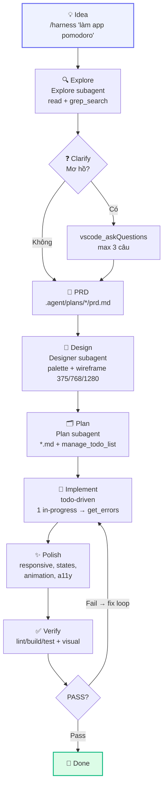

# CLAUDE HARNESS v2 — VS Code Copilot

> **Process > Model.** Dù GPT / Claude / Gemini đều chạy cùng pipeline. Một ý tưởng nhỏ → **sản phẩm hoàn chỉnh, giao diện đẹp** — không phụ thuộc model.

Harness biến VS Code Copilot Chat thành **Claude Code Extension**: tự động, todo-driven, explore trước khi code, plan trước khi implement, polish trước khi done. Mọi customization (skill / rule / agent / prompt / hook) đều **tháo lắp như plugin** — bật/tắt không xóa, preset theo dự án, scaffold 1 lệnh.

---

## Mục lục

- [Nhanh — 30s](#nhanh--30s)
- [Claude Code (export)](#claude-code-export)
- [Sơ đồ /harness](#sơ-đồ-harness)
- [Khả năng](#khả-năng)
- [Tháo lắp & Preset](#tháo-lắp--preset)
- [Custom dễ dàng](#custom-dễ-dàng)
- [Demo — Focus Flow](#demo--focus-flow)
- [Cấu trúc](#cấu-trúc)
- [Docs](#docs)
- [Yêu cầu](#yêu-cầu)

---

## Nhanh — 30s

### Trong Copilot Chat

```
/harness làm web pomodoro với thống kê
/product app quản lý chi tiêu
/plan thêm tính năng X
/polish
/verify
```

### Trong terminal (Node 18+)

```bash
# Xem đang có gì
node .github/harness/scripts/harness-manager.mjs status
node .github/harness/scripts/harness-manager.mjs list

# Tháo lắp rule theo dự án
node .github/harness/scripts/harness-manager.mjs disable instruction product-quality
node .github/harness/scripts/harness-manager.mjs enable instruction product-quality

# Preset 1 lệnh cho cả dự án
node .github/harness/scripts/harness-manager.mjs preset apply web-product   # web cần đẹp
node .github/harness/scripts/harness-manager.mjs preset apply api-minimal   # API gọn

# Tạo mới từ template
node .github/harness/scripts/harness-manager.mjs create instruction my-rule

# Sinh assets cho Claude Code (.claude/ + CLAUDE.md) từ .github/
node .github/harness/scripts/harness-manager.mjs export-claude
node .github/harness/scripts/harness-manager.mjs export-claude --check   # dry-run cho CI
```

---

## Claude Code (export)

`.github/` là **source of truth** cho cả Copilot lẫn Claude Code. Lệnh `export-claude` sinh **một chiều** `.github → .claude/` + `CLAUDE.md`:

| Nguồn (`.github/`) | Đích Claude Code |
|---|---|
| `copilot-instructions.md` | `CLAUDE.md` (root) |
| `agents/*.agent.md` | `.claude/agents/*.md` |
| `prompts/*.prompt.md` | `.claude/commands/*.md` (`${input:...}` → `$ARGUMENTS`) |
| `instructions/*.instructions.md` (`applyTo`) | `.claude/rules/*.md` (`paths:`; `"**"` → always-load) |
| `skills/<name>/` | `.claude/skills/<name>/` (giữ nguyên `scripts/ data/ references/`) |
| `hooks/hooks.json` | merge vào `.claude/settings.json` (schema nested) |

- **Idempotent**: chạy lại không đổi gì nếu `.github/` không đổi; manifest orphan ở `.claude/harness-export.json`.
- **Tool names** tự dịch Copilot → Claude (`get_errors`→IDE diagnostics, `manage_todo_list`→TodoWrite, `vscode_askQuestions`→AskUserQuestion, ...).
- Chạy lại sau mỗi `enable`/`disable`/`create`/`preset apply`. **Commit** cả `.claude/` + `CLAUDE.md`.
- File generated có marker `DO NOT EDIT` — sửa ở `.github/` rồi export lại.
- Trong Claude Code: hooks từ `.claude/settings.json` cần **accept workspace trust** mới chạy.

---

## Sơ đồ /harness

Gõ `/harness <task>` → chạy **8 phase bắt buộc**, không bỏ bước:

```
Idea → Explore → Clarify → PRD → Design → Plan → Implement → Polish → Verify → Done
```



- **Rút gọn cho task nhỏ (1-2 file):** Explore(quick) → Clarify(1 câu) → PRD mini(5 dòng) → Design mini → Plan(3 todos) → Implement → Polish → Verify. **Không bỏ Polish.**
- **Todo-driven:** 5-10 todos, 3-7 từ/todo, 1 `in-progress` tại 1 thời điểm, `get_errors` sau mỗi edit.
- **Verify loop:** Fail → fix → re-run, max 3 lần/check. Chỉ `task_complete` khi PASS.

Chi tiết: [`docs/harness-flow.md`](docs/harness-flow.md) (flowchart + sequence + architecture + decision)

---

## Khả năng

| Nhóm | Cái gì | Tháo lắp | Cài GitHub | Tạo mới | Slash | Subagent |
|------|--------|:--------:|:----------:|:-------:|:-----:|:--------:|
| **Skill** | Workflow on-demand (claude-harness, skill-registry, custom-registry) | ✅ | ✅ | ✅ | ✅ | — |
| **Instruction** | Rule theo `applyTo` (harness-workflow, product-quality, ...) | ✅ | ✅ | ✅ | — | — |
| **Agent** | Subagent chuyên vai (Explore, Plan, Designer, Implement, Polish, Verify) | ✅ | ✅ | ✅ | — | ✅ |
| **Prompt** | Task template (`/harness`, `/product`, `/plan`, ...) | ✅ | ✅ | ✅ | ✅ | — |
| **Hook** | Deterministic shell (`PostToolUse`, `Stop`, ...) | ✅ | ✅ | ✅ | — | — |
| **Preset** | Bộ bật/tắt theo dự án (full, web-product, api-minimal) | — | — | ✅ | — | — |
| **Template** | Scaffold nhanh (instruction, agent, prompt, skill) | — | — | — | — | — |

- **Wise loading:** Chỉ load khi `description`/`applyTo` match task — không nhồi 20 thứ cùng lúc.
- **Registry v2:** `.github/harness/registry.json` (commit vào git) — source of truth cho mọi loại, đồng bộ `.github/skills/registry.json` cho skills.
- **Product Quality:** Palette 3-5 màu, typography 1-2 font, spacing 4/8px, responsive 375/768/1280, states đầy đủ, animation 150-300ms, a11y ≥4.5:1.

Chi tiết: [`docs/capabilities.md`](docs/capabilities.md) (14 chương, ma trận, lệnh tổng hợp)

---

## Tháo lắp & Preset

### CLI chính

```bash
node .github/harness/scripts/harness-manager.mjs <command> [options]
# Types: skill | instruction | agent | prompt | hook
```

| Lệnh | Ví dụ |
|------|-------|
| `list [--type <type>]` | `list --type instruction` |
| `status` | `status` |
| `enable <type> <name>` | `enable instruction product-quality` |
| `disable <type> <name>` | `disable agent designer` |
| `uninstall <type> <name>` | `uninstall prompt my-prompt` |
| `install <type> owner/repo --path ... --ref main` | `install instruction owner/repo --path instructions/nextjs.instructions.md` |
| `install <type> --local ./path` | `install skill --local ./my-skill` |
| `create <type> <name>` | `create instruction my-rule` |
| `preset list / apply / save` | `preset apply web-product` |
| `sync` | `sync` (sau khi clone repo) |

**Cơ chế:** `disable` = move file/folder → `.disabled/` + `registry.enabled=false` (không xóa). `enable` = move ngược. `uninstall` = xóa hẳn.

### Presets sẵn

| Preset | Dùng khi | Tắt gì |
|--------|----------|--------|
| `full` | Muốn tất cả | — |
| `web-product` | Web cần giao diện đẹp | — (bật product-quality, designer, polish) |
| `api-minimal` | API/script gọn nhẹ | product-quality, designer, polish, product/polish prompts |

```bash
node .github/harness/scripts/harness-manager.mjs preset apply web-product
node .github/harness/scripts/harness-manager.mjs preset apply api-minimal
node .github/harness/scripts/harness-manager.mjs preset save my-preset  # lưu bộ hiện tại
```

Presets là JSON trong `.github/harness/presets/` — sửa tay được.

### Skill Registry (wrapper, chỉ skill)

```bash
node .github/skills/skill-registry/scripts/skill-manager.mjs list
node .github/skills/skill-registry/scripts/skill-manager.mjs install owner/repo --path skills/foo
```

Nên dùng `harness-manager` cho mọi loại — `skill-manager` giữ lại để tương thích.

---

## Custom dễ dàng

```bash
# Tạo mới từ template — đã có frontmatter chuẩn, chỉ sửa description/applyTo
node .github/harness/scripts/harness-manager.mjs create instruction my-rule
node .github/harness/scripts/harness-manager.mjs create agent my-agent
node .github/harness/scripts/harness-manager.mjs create prompt my-prompt
node .github/harness/scripts/harness-manager.mjs create skill my-skill
node .github/harness/scripts/harness-manager.mjs create hook my-hook

# Cài từ GitHub
node .github/harness/scripts/harness-manager.mjs install instruction owner/repo --path instructions/nextjs.instructions.md
node .github/harness/scripts/harness-manager.mjs install skill owner/repo --path skills/my-skill --ref main

# Gợi ý
# - Viết description giàu keyword: "Use when building Next.js app, need ..."
# - applyTo cho instruction: "**" (global) vs "**/*.{ts,tsx}" (chỉ TS) vs "src/api/**" (chỉ API)
# - Đừng bật 20 thứ cùng lúc — dùng preset
```

Templates: `.github/harness/templates/` (instruction.md, agent.md, prompt.md, skill-SKILL.md)

---

## YUNIE — System Chatbot + STATUS

Chatbot hệ thống hiểu toàn bộ Harness, làm task về hệ thống, kiểm tra tình trạng, cập nhật STATUS và deploy GitHub Pages.

- **Agent** `.github/agents/yunie.agent.md` — `user-invocable: true`, gọi `@YUNIE kiểm tra hệ thống` hoặc `yunie cập nhật status` trong Copilot Chat
- **STATUS site** `www/index.html` + `status.json` + `styles.css` + `app.js` — dashboard fetch `status.json`, responsive 375/768/1280
- **Deploy** `.github/workflows/pages.yml` — upload toàn bộ `www/` lên GitHub Pages (trigger `push` `www/**`)
- **Thêm trang mới:** chỉ cần copy file vào `www/` (vd: `www/docs.html`) là tự lên Pages — không cần sửa workflow. YUNIE sẽ thêm entry vào `status.json → pages.entries`.

Mở local: `www/index.html` (file://) · Sau push: `https://<user>.github.io/<repo>/`

---

## Demo — Focus Flow

Ý tưởng 1 câu → product hoàn chỉnh qua Harness v2:

- **PRD** `.agent/plans/focus-flow/prd.md` · **Design** `.agent/plans/focus-flow/design.md` · **Plan** `.agent/plans/focus-flow/plan.md`
- **Code** `focus-flow/index.html` + `styles.css` (CSS variables) + `app.js` (timer drift-free, task CRUD, stats, localStorage, sound, Notification, keyboard Space/R)
- **Polish** responsive 375/768/1280 không vỡ, states đầy đủ, toast/confetti, a11y
- **Verify** `get_errors` pass, visual check browser

Mở: `focus-flow/index.html` (file://, không cần build)

---

## Cấu trúc

```
.
├── README.md
├── docs/
│   ├── harness-flow.md      # Sơ đồ /harness (flowchart, sequence, architecture)
│   └── capabilities.md      # Toàn bộ khả năng hệ thống
├── .agent/plans/            # PRD / Design / Plan trace (mỗi task 1 thư mục)
│   ├── focus-flow/
│   │   ├── prd.md
│   │   ├── design.md
│   │   └── plan.md
│   ├── todo-manager/
│   │   ├── prd.md
│   │   ├── design.md
│   │   └── plan.md
│   └── ...
├── .github/
│   ├── copilot-instructions.md          # Harness v2 — Identity + Pipeline
│   ├── workflows/pages.yml              # Deploy www/ → GitHub Pages
│   ├── harness/
│   │   ├── registry.json                # v2 unified (commit vào git) — 7 agents gồm YUNIE
│   │   ├── presets/                     # full, web-product, api-minimal (đều bật yunie)
│   │   ├── templates/                   # instruction, agent, prompt, skill
│   │   ├── scripts/harness-manager.mjs  # CLI chính
│   │   └── README.md
│   ├── skills/                          # claude-harness, skill-registry, custom-registry
│   │   ├── registry.json                # v1 compat (auto-sync)
│   │   └── .disabled/
│   ├── instructions/                    # harness-workflow, product-quality, ...
│   │   └── .disabled/
│   ├── agents/                          # Explore, Plan, Designer, Implement, Polish, Verify, YUNIE
│   │   └── .disabled/
│   ├── prompts/                         # /harness, /product, /plan, /implement, /polish, /verify
│   │   └── .disabled/
│   └── hooks/
│       └── .disabled/ (tự tạo khi disable)
├── www/                                 # STATUS site — root của GitHub Pages
│   ├── index.html                       # Dashboard (fetch status.json)
│   ├── status.json                      # Source of truth (YUNIE generate)
│   ├── styles.css                       # Design system Indigo/Sky/Amber
│   └── app.js                           # Render dashboard
└── focus-flow/                          # Demo product
    ├── index.html
    ├── styles.css
    └── app.js
```

---

## Docs

| Doc | Mô tả |
|-----|-------|
| [`docs/harness-flow.md`](docs/harness-flow.md) | Sơ đồ khi dùng `/harness` — flowchart, sequence, architecture, decision, chi tiết 8 phase |
| [`docs/capabilities.md`](docs/capabilities.md) | Toàn bộ khả năng — Harness, Skills, Instructions, Agents (gồm YUNIE), Prompts, Hooks, Registry, Presets, Templates, Product Quality, Memory, www/ STATUS, Demo, ma trận, lệnh tổng hợp |
| [`.github/harness/README.md`](.github/harness/README.md) | Harness Registry — tháo lắp, preset, scaffold |
| [`.github/skills/custom-registry/SKILL.md`](.github/skills/custom-registry/SKILL.md) | `/custom-registry` — hướng dẫn tháo lắp toàn bộ |
| [`.github/skills/skill-registry/SKILL.md`](.github/skills/skill-registry/SKILL.md) | `/skill-registry` — hướng dẫn skill registry |
| [`.github/copilot-instructions.md`](.github/copilot-instructions.md) | Harness v2 — pipeline + tool priority + anti-patterns |

---

## Yêu cầu

- **Node 18+** (có `fetch` built-in) — cho `harness-manager` / `skill-manager`
- **VS Code / VS Code Insiders** + **Copilot Chat** (Agent mode)
- `GITHUB_TOKEN` env optional — để tránh rate limit khi cài nhiều từ GitHub

---

*Harness v2: Process > Model. Idea nhỏ → Product đẹp. Mọi model đều chạy cùng pipeline. Mọi thứ đều là plugin — YUNIE trực hệ thống, www/ lên Pages.*
