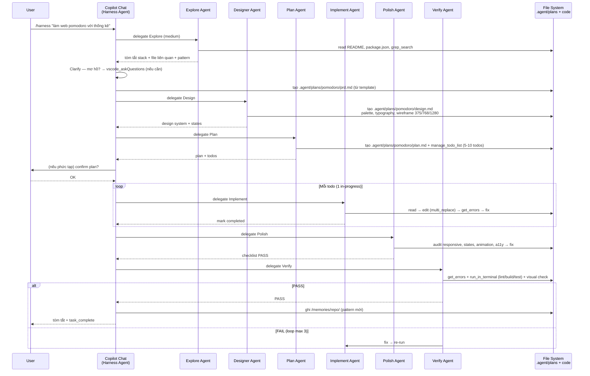
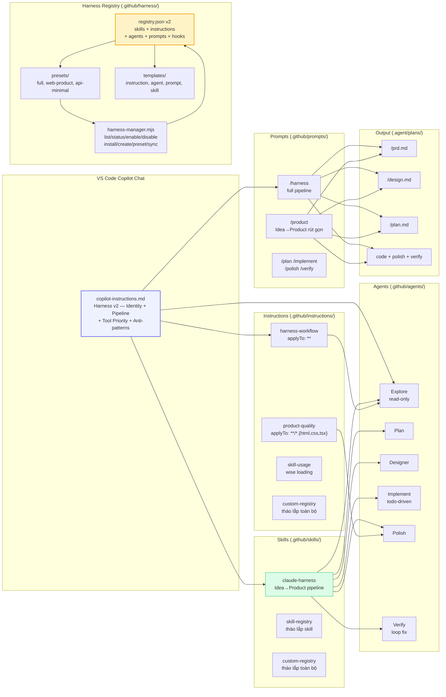
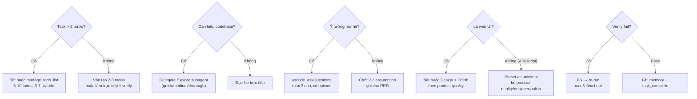

# Harness Flow — Sơ đồ khi dùng `/harness`

> Skill: `claude-harness` — Harness v2 product-driven, model-agnostic. Một ý tưởng nhỏ → sản phẩm hoàn chỉnh, giao diện đẹp.

## 1. Tổng quan

Gõ `/harness` (hoặc `/product` cho ý tưởng 1 câu) trong VS Code Copilot Chat → agent chạy **pipeline 8 phase bắt buộc**, không bỏ bước, không nhảy Idea → Code, không bỏ Polish.

```
Idea → Explore → Clarify → PRD → Design → Plan → Implement → Polish → Verify → Done
```

- **Model-agnostic:** GPT / Claude / Gemini đều chạy cùng pipeline — chất lượng đến từ **process**, không phụ thuộc model.
- **Product-driven:** Mọi task phải ra sản phẩm dùng được, UI đẹp, UX mượt.
- **Todo-driven:** Mọi task >2 bước phải `manage_todo_list`, 1 todo `in-progress` tại 1 thời điểm, `get_errors` sau mỗi edit.
- **Verify before Done:** Không `task_complete` khi chưa build/test/lint pass + visual check.

---

## 2. Sơ đồ tổng — Flowchart

```mermaid
flowchart TD
    A["💡 Idea<br/>User: /harness 'làm app pomodoro'<br/>hoặc 1 câu ý tưởng"] --> B["🔍 Explore<br/>Subagent Explore (quick/medium)<br/>read + grep_search"]
    B --> C{"❓ Clarify<br/>Ý tưởng mơ hồ?"}
    C -- "Có → hỏi" --> C1["vscode_askQuestions<br/>max 3 câu, có options<br/>chốt giả định"]
    C -- "Rõ → chốt assumption" --> D
    C1 --> D["📄 PRD<br/>.agent/plans/&lt;slug&gt;/prd.md<br/>Vision, User Stories P0/P1,<br/>Scope In/Out, Non-Goals, Metrics"]
    D --> E["🎨 Design<br/>Subagent Designer<br/>.agent/plans/&lt;slug&gt;/design.md<br/>Palette 3-5 màu, Typography,<br/>Wireframe 375/768/1280, States"]
    E --> F["🗂️ Plan<br/>Subagent Plan<br/>.agent/plans/&lt;slug&gt;/plan.md<br/>+ manage_todo_list<br/>5-10 todos, File Changes, Risks"]
    F --> G{"📋 Plan cần duyệt?"}
    G -- "Phức tạp → hỏi user" --> G1["Chờ confirm"]
    G1 --> H
    G -- "Đơn giản → tiếp" --> H["🔨 Implement<br/>Subagent Implement<br/>todo-driven, 1 in-progress<br/>read → edit → get_errors → completed"]
    H --> I["✨ Polish<br/>Subagent Polish<br/>Responsive, states,<br/>animation 150-300ms, a11y<br/>audit theo product-quality"]
    I --> J["✅ Verify<br/>Subagent Verify<br/>get_errors + lint/build/test<br/>+ visual check (browser)"]
    J --> K{"PASS?"}
    K -- "Fail → fix loop<br/>max 3 lần/check" --> H
    K -- "Pass" --> L["🎉 Done<br/>task_complete<br/>+ ghi memory /memories/repo/"]
    K -- "Blocked" --> M["🚧 Báo blocker<br/>cần human"]

    style A fill:#eef2ff,stroke:#6366f1,stroke-width:2px
    style D fill:#fef3c7,stroke:#f59e0b
    style E fill:#fce7f3,stroke:#ec4899
    style F fill:#e0f2fe,stroke:#06b6d4
    style H fill:#dcfce7,stroke:#10b981
    style I fill:#f3e8ff,stroke:#8b5cf6
    style J fill:#ffedd5,stroke:#f97316
    style L fill:#dcfce7,stroke:#10b981,stroke-width:2px
```



### Rút gọn cho task nhỏ (1-2 file)

```
Explore(quick) → Clarify(1 câu) → PRD mini(5 dòng) → Design mini(palette+layout) → Plan(3 todos) → Implement → Polish → Verify
```

> **Không bỏ Polish** — giao diện xấu = chưa xong.

---

## 3. Sơ đồ tuần tự — Sequence khi user gõ `/harness`



---

## 4. Sơ đồ kiến trúc — Harness v2 + Registry



---

## 5. Chi tiết từng Phase

| Phase | Mục tiêu | Input | Output | Tool chính | Subagent | Bỏ được? |
|-------|----------|-------|--------|------------|----------|----------|
| **Explore** | Hiểu codebase + context | Idea, workspace | Tóm tắt stack, file liên quan, pattern | `read_file`, `grep_search`, `list_dir` | `Explore` | ❌ |
| **Clarify** | Làm rõ mơ hồ | Idea | Câu hỏi + giả định chốt (ghi vào PRD) | `vscode_askQuestions` | — | Rút gọn nếu rõ |
| **PRD** | Biến ý tưởng thành spec | Clarify + Explore | `.agent/plans/<slug>/prd.md` | template `prd-template.md` | `Plan` | ❌ (mini 5 dòng cũng phải có) |
| **Design** | Định nghĩa giao diện đẹp | PRD | `.agent/plans/<slug>/design.md` | template `design-template.md` | `Designer` | ❌ |
| **Plan** | Chia nhỏ để code | PRD + Design | `.agent/plans/<slug>/plan.md` + `manage_todo_list` | `manage_todo_list` | `Plan` | ❌ |
| **Implement** | Code todo-driven | Plan + todos | Files code | `replace_string_in_file`, `multi_replace`, `get_errors` | `Implement` | ❌ |
| **Polish** | Làm đẹp + UX | Code + Design | Responsive, states, animation, a11y | `read_file`, `replace`, `open_browser_page` | `Polish` | ❌ |
| **Verify** | Đảm bảo chất lượng | Code | build/test/lint pass + visual check | `get_errors`, `run_in_terminal` | `Verify` | ❌ |

### Outputs mẫu (Focus Flow demo)

- PRD: `.agent/plans/focus-flow/prd.md` — Vision, 6 User Stories (P0/P1), Scope In/Out, Metrics, Edge Cases
- Design: `.agent/plans/focus-flow/design.md` — Palette Indigo/Mint/Amber, Typography Inter + Plus Jakarta Sans, Wireframe 375/768/1280, Component States, UX States
- Plan: `.agent/plans/focus-flow/plan.md` — Architecture (vanilla HTML/CSS/JS, localStorage), File Changes, Risks, Todos 7 bước
- Code: `focus-flow/index.html` + `styles.css` (CSS variables) + `app.js` (timer drift-free, task CRUD, stats, a11y)
- Polish: responsive 375/768/1280 không vỡ, hover/focus/active/disabled/loading, toast/confetti, keyboard Space/R
- Verify: `get_errors` pass, visual check browser, `harness-manager status` pass

---

## 5b. Pipeline /fixbug — Bounded Repair Loop (6 execution + Done = 7 phases)

> Không dùng `/harness` cho bug — sẽ tạo PRD/Design thừa. `/fixbug` là **bounded repair loop**, không phải `/harness` thu nhỏ.

```
Read Knowledge → Reproduce → Root Cause → Fix → Verify → Learn → Done
  (6 execution + Done)
```

| Phase | Mục tiêu | Output | Bỏ được? |
|-------|----------|--------|----------|
| 0. Read Knowledge | Đọc bài học cũ, tránh lặp lại | Đã đọc `docs/knowleged.md` | ❌ |
| 1. Reproduce | Tái hiện bug có bằng chứng | Steps + Expected/Actual + evidence | ❌ |
| 2. Root Cause | file:line + 5 Whys | Root cause + confidence | ❌ |
| 3. Fix | Sửa ở gốc, bounded, todo-driven | Code + `get_errors` affected files | ❌ |
| 4. Verify | Không regression | Re-test + edge + regression + build/lint (full scope) | ❌ |
| 5. Learn | Biến bug thành knowledge | `.agent/bugs/<slug>/bug.md` + `docs/knowleged.md` KN-XXX | ❌ |
| 6. Done | Đóng vòng, báo cáo | Tóm tắt + KN + files changed | ❌ |

**Bounded repair loop — Gates:**

```
0 Knowledge Gate
→ 1 Reproduce Gate ── FAIL → ask / stop
→ 2 Root Cause Gate ── uncertain → investigate / escalate
→ 3 Minimal Fix (scope control, 3-5 todos, không refactor lan rộng)
→ 4 Verification Gate (reproduce + regression + build/errors — full scope)
→ 5 Learning Gate (bug.md + knowleged.md KN-XXX)
→ DONE (confidence ≥ MEDIUM mới close)
```

- **Fix Confidence:** `HIGH` (proven + regression pass) | `MEDIUM` (strongly supported + reproduction fixed) | `LOW` (symptom fixed, root uncertain → STOP, report uncertainty, ask/escalate to `/harness`)
- **Fresh-eyes tiered (KN-005):** `REQUIRED` (UX/UI/workflow/ambiguous) | `RECOMMENDED` (regression-prone) | `OPTIONAL` (deterministic: typo/null check/API mapping)
- **get_errors phân tầng:** Phase 3 → affected files sau mỗi edit; Phase 4 → toàn scope + build/test
- **Explore tiết kiệm:** Chỉ delegate `Explore` khi bug rộng/chưa rõ vị trí; bug nhỏ dùng `grep_search`/`read_file` trực tiếp
- **Scope control:** Chỉ sửa ở gốc, không refactor lan rộng — việc lớn ghi `Non-Goals` trong `bug.md`

Chi tiết: `.github/prompts/fixbug.prompt.md` · `.github/instructions/harness-workflow.instructions.md` · `.agent/bugs/_template/bug.md`

---

## 6. Luồng quyết định (Decision)



---

## 7. Lệnh liên quan

| Lệnh | Dùng khi |
|------|----------|
| `/harness <task>` | Full pipeline 8 phase — mọi task code |
| `/product <idea>` | Rút gọn cho ý tưởng 1 câu → product đẹp |
| `/plan <task>` | Chỉ tạo PRD + Design + Plan (chưa code) |
| `/implement` | Chỉ implement plan đã duyệt (todo-driven) |
| `/polish [target]` | Chỉ polish UI/UX theo product-quality |
| `/verify` | Chỉ verify build/test/lint + visual |

Tham chiếu: `.github/skills/claude-harness/SKILL.md` · `.github/prompts/harness.prompt.md` · `.github/copilot-instructions.md`

---

*Harness v2: Process > Model. Idea nhỏ → Product đẹp. Mọi model đều chạy cùng pipeline.*
