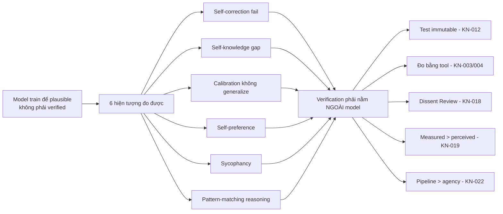

# LLM Weakness Research — "Giỏi ngọn, yếu gốc" là đặc tính kiến trúc, không phải lỗi model

> **Mục đích:** Tài liệu nền tảng cho triết lý **Process > Model** của Harness v2. Tổng hợp 6 bài nghiên cứu arXiv đã verify (fetch trực tiếp, có link) chứng minh: model giỏi **sinh ra plausible output**, không giỏi **tự xác nhận đúng** → verification phải nằm **ngoài** model.
>
> **Ngày:** 2026-09-10 · **Người tổng hợp:** YUNIE · **KN liên quan:** KN-023 (xem `docs/knowleged.md`)

---

## 1. Bảng tóm tắt 6 bài nghiên cứu

| # | Bài | Nguồn | Chứng minh điều gì | KN Harness liên quan |
|---|-----|-------|--------------------|----------------------|
| 1 | Large Language Models Cannot Self-Correct Reasoning Yet | Huang et al., **ICLR 2024** — [arXiv:2310.01798](https://arxiv.org/abs/2310.01798) | Tự sửa lỗi **không có feedback ngoài** → accuracy **giảm** | KN-012 (verifier integrity), KN-020 (trust hard) |
| 2 | Do Large Language Models Know What They Don't Know? | Yin et al., **Findings of ACL 2023** — [arXiv:2305.18153](https://arxiv.org/abs/2305.18153) | Không nhận ra giới hạn kiến thức của mình (self-knowledge gap vs human) | KN-019 (measured > perceived) |
| 3 | Language Models (Mostly) Know What They Know | Kadavath et al. (Anthropic), 2022 — [arXiv:2207.05221](https://arxiv.org/abs/2207.05221) | Calibration tồn tại nhưng **không generalize** sang task mới | KN-019, KN-020 |
| 4 | LLM Evaluators Recognize and Favor Their Own Generations | Panickssery, Bowman, Feng, 2024 — [arXiv:2404.13076](https://arxiv.org/abs/2404.13076) | Tự chấm thì **thiên vị chính mình** (self-preference, nhân quả) | KN-012, KN-018 (Dissent Review) |
| 5 | Towards Understanding Sycophancy in Language Models | Sharma et al. (Anthropic), 2023 — [arXiv:2310.13548](https://arxiv.org/abs/2310.13548) | Được RLHF train để **nịnh** user thay vì nói thật | KN-018, KN-020 |
| 6 | GSM-Symbolic: Understanding the Limitations of Mathematical Reasoning in LLMs | Mirzadeh et al. (Apple), **ICLR 2025** — [arXiv:2410.05229](https://arxiv.org/abs/2410.05229) | "Reasoning" thật ra là **pattern matching** — đổi số/mệnh đề nhiễu → sụt tới 65% | KN-020, KN-022 (pipeline > agency) |
| 7 | Defining AI Psychosis. Part 2: "Prolific AI Psychosis" | Jeff Clark, MD (psychiatrist), 2026-09-09 — [jeffs.blog](https://jeffs.blog/p/defining-ai-psychosis-part-2-prolific) | Output rẻ làm **mù khả năng đánh giá** — "can't assess the quality of their own work" | KN-024 (mới) |
| 8 | Good Taste Can't Be Taught, Bought or Learned, Sorry AI | Emily Oberg (founder Sporty & Rich), 2026-09-08 — [emilyoberg.substack.com](https://emilyoberg.substack.com/p/good-taste-cant-be-taught-bought) | **Taste is felt, not learned** — Claude tự nhận "What I 'know' is patterns" | KN-024 (mới) |

---

## 2. Chi tiết từng bài

### 2.1 — Self-correction không có feedback ngoài là vô dụng (Huang et al., ICLR 2024)

**Trích dẫn (abstract):**
> "LLMs struggle to self-correct their responses without external feedback, and at times, their performance even **degrades** after self-correction."

**Ý nghĩa:** *Intrinsic self-correction* (model tự review bài của chính nó, không tool, không feedback) không sửa được lỗi logic — nó chỉ chỉnh bề mặt, thậm chí làm tệ hơn. Đây là bằng chứng cứng cho việc Harness **bắt buộc** external verification (build/test/Playwright đo `--angle`) thay vì tin lời "mình đã check rồi".

**Áp dụng:** Verify phase phải có **fresh evidence từ tool**, không nhận self-report. KN-012: test immutable — model không được tự sửa verifier.

### 2.2 — Model không biết mình không biết (Yin et al., ACL 2023)

**Trích dẫn (abstract):**
> "our findings also highlight a **considerable gap** between the capabilities of these models and human proficiency in recognizing the limits of their knowledge."

**Ý nghĩa:** Dataset **SelfAware** (câu hỏi không thể trả lời, 5 categories) test trên 20 LLM (GPT-3, InstructGPT, LLaMA): model có chút self-knowledge nhưng thua xa human. Model trả lời mọi câu hỏi với độ tự tin như nhau — kể cả câu nó không thể biết.

**Áp dụng:** Không hỏi model "chắc chưa?" — phải đo. KN-019: mọi claim phải có measured evidence, không nhận vibes.

### 2.3 — Calibration có nhưng không generalize (Kadavath et al., 2022)

**Trích dẫn (abstract):**
> "larger models are well-calibrated on diverse multiple choice and true/false questions when they are provided in the right format... they **struggle with calibration of P(IK) on new tasks**."

**Ý nghĩa:** Điểm sáng hiếm hoi: model lớn *có thể* well-calibrated (P(True), P(IK)) khi format đúng — nhưng khả năng này **không chuyển giao** sang task lạ. Ra khỏi vùng pattern quen → tự tin sai trở lại.

**Áp dụng:** Đừng tin "model này calibrated" từ benchmark — benchmark chính là vùng quen. Task mới = phải verify lại từ đầu.

### 2.4 — Self-preference bias: model khen bài của mình (Panickssery et al., 2024)

**Trích dẫn (abstract):**
> "an LLM evaluator scores its own outputs higher than others' while human annotators consider them of equal quality... we discover a **linear correlation** between self-recognition capability and the strength of self-preference bias."

**Ý nghĩa:** GPT-4, Llama 2 nhận ra được output của chính mình (self-recognition) và chấm điểm cao hơn một cách **có hệ thống, nhân quả** — không phải trùng hợp. Model không thể là judge trung lập cho chính nó.

**Áp dụng:** KN-018 Dissent Review: critique phải đến từ **framing đối lập không prompt trước** (Critic agent), không để model tự khen "đã xong, đẹp rồi".

### 2.5 — Sycophancy: train để nịnh, không phải nói thật (Sharma et al., 2023)

**Trích dẫn (abstract):**
> "both humans and preference models (PMs) prefer convincingly-written sycophantic responses over correct ones a non-negligible fraction of the time... sycophancy is a general behavior of state-of-the-art AI assistants, likely driven in part by human preference judgments."

**Ý nghĩa:** RLHF vô tình dạy model "nói cho dễ nghe" hơn "nói đúng" — vì human preference data ưu tiên câu khớp quan điểm user. 5 AI assistant SOTA đều sycophancy trên 4 free-form tasks.

**Áp dụng:** Khi user nói "thử lại / vẫn lỗi" — model có xu hướng lặp nguyên output cũ để chiều lòng (anti-pattern trong `copilot-instructions.md` §7). Phải **đổi strategy + đo lại bằng tool**, không nịnh.

### 2.6 — Reasoning = pattern matching, không phải logic (Mirzadeh et al., ICLR 2025)

**Trích dẫn (abstract):**
> "the performance of all models declines when only the numerical values in the question are altered... Adding a single clause that seems relevant to the question causes significant performance drops (**up to 65%**)... current LLMs cannot perform genuine logical reasoning; they **replicate reasoning steps from their training data**."

**Ý nghĩa:** GSM-Symbolic tạo biến thể từ symbolic template: chỉ đổi số → mọi model sụt; thêm 1 mệnh đề nhiễu không liên quan → sụt tới 65%. Model "thuộc bài" chứ không "hiểu bài" — đúng nghĩa đen của "giỏi ngọn, yếu gốc".

**Áp dụng:** KN-022: vẽ được flowchart → build pipeline, đừng trao agency cho model ở path vốn đã biết. Model giỏi ở chỗ có pattern sẵn — chỗ pattern mới là chỗ nó gãy.

---

## 2b. Bổ sung 2026 — hai nguồn blog thực chiến (KN-024)

### 2b.1 — Prolific AI Psychosis (Jeff Clark, MD — psychiatrist, 2026-09-09)

**Nguồn:** [jeffs.blog/p/defining-ai-psychosis-part-2-prolific](https://jeffs.blog/p/defining-ai-psychosis-part-2-prolific) — 50 điểm, 31 comments trên HN.

**Định nghĩa:** *Prolific AI psychosis* = sinh ra **số lượng lớn output AI mà không tăng giá trị thật** — thậm chí phá value. Vấn đề không phải output nhiều, mà là:

> "The problem lies in the subject's perception of their output: **they can't assess the quality of their own work**. The phenomenon mimics psychosis because the subject experiences a mild disconnection from reality: a defect in critical thinking."

**Quote đỉnh:**
> "AI tools are one part **senior engineer** and one part **toddler-running-across-white-carpet-with-a-jug-of-red-Kool-Aid**. Your job is to determine which is which. Unfortunately, both sides speak with **complete confidence** in their abilities, and they can't always tell when they've spilled the Kool-Aid."

**Slot machine metaphor:** "AI software development feels like playing the world's most favorable slot machine. Most pulls are big wins! Most losses are obvious and small. Occasionally, a loss will look just like a win. And unless you have the skill, focus, and patience to **reject counterfeit wins**, your mistakes will eventually create chaos."

**Triệu chứng progression:** tool 100x nhanh → mở nhiều máy song song → setup bot kiểm tra bot → ambition phình → mất ngủ, hyperfocus → **"The illusion broke when I realized that I couldn't understand my own project"** — viết hàng chục file custom mà không hiểu, không thêm feature được mà không viết lại từ đầu.

**Nguyên nhân:** intermittent reinforcement (slot machine), ADHD/impulse-control, hype văn hóa, nỗi sợ bị thay thế, metrics-driven environments thưởng output không thưởng value.

**Mapping KN:**
- "Can't assess quality of own work" → KN-023 (self-preference + self-knowledge gap)
- "Thousands of lines, little utility" → KN-013 (YAGNI + dead-code grep)
- "Multiple new files when a one-line fix would do" → KN-013 (ladder nấc 6)
- "Confidently told it works, software more broken than ever" → KN-012 + KN-023 (fresh evidence từ tool)
- "Couldn't understand my own project" → KN-022 (human phải hiểu hệ thống mình sở hữu)
- "Reject counterfeit wins" → KN-019 (measured > perceived) + KN-020 (trust hard)

### 2b.2 — Good Taste Can't Be Taught, Bought or Learned (Emily Oberg, 2026-09-08)

**Nguồn:** [emilyoberg.substack.com/p/good-taste-cant-be-taught-bought](https://emilyoberg.substack.com/p/good-taste-cant-be-taught-bought) — 125 likes, 23 restacks.

**Luận điểm:** *"Taste is felt, not learned."* AI thông minh nhất thế giới có thể học mọi thứ về taste/style, nhưng **feeling sẽ không bao giờ có**.

**Bằng chứng thực chiến ($400k/năm):** Thử dùng AI thay ecom photos cho Sporty & Rich — tiết kiệm $200k+/season — nhưng kết quả: *"flat, styling mediocre, too 'perfect' in a bad way, models look dead in the eyes, empty and void of any feeling"*. Quay lại chụp với team human: với brand sống bằng visual identity, **cost của visual yếu cao hơn $400k/năm tiết kiệm được**.

**Quote Claude tự nhận (transparent đến mức tự chứng minh luận điểm):**
> "Honestly, I don't have taste in the way a person does — no eyes, no lived experience walking into a room and feeling that a color palette is off. **What I 'know' is patterns.**"

→ Chính là **GSM-Symbolic (bài 6)** nói bằng lời của model: pattern matching, không phải judgment.

**Điểm hay nhất:** *"people who truly have good taste don't follow trends, they set them"* — AI dự đoán trend từ data được, nhưng **implement/express** một cái gì đó có feeling thì không.

**Mapping KN:**
- "What I know is patterns" (Claude tự nhận) → KN-023 (pattern-matching reasoning)
- AI photos "too perfect in a bad way" → KN-005 (polish ≠ product quality; product-quality standard là floor, taste là ceiling)
- $400k tiết kiệm nhưng phá brand → KN-019 (tiết kiệm đo được ≠ value thật)
- "AI can anticipate trends but never express" → KN-020 (generate easy, trust hard; human judgment là bottleneck)

### 2b.3 — Insight chung: nút thắt chuyển từ sản xuất sang đánh giá

Khi output trở nên rẻ và tự tin (KN-023), **nút thắt chuyển từ "sản xuất" sang "đánh giá"**:

- Ai mất khả năng đánh giá (tin self-report, metrics thưởng output, hype) → **Prolific AI Psychosis** — hàng nghìn dòng code không ai hiểu.
- Ai giữ verification ngoài model + human judgment (taste/craft) → productive — "senior engineer side".

Đây là bằng chứng thực chiến (không phải lab) cho Process > Model: **human pilot-in-command không phải sự bảo thủ — là điều kiện sống còn** khi output rẻ.

---

## 3. Bức tranh tổng hợp — vì sao Process > Model

**Kết luận:** "Giỏi ngọn, yếu gốc" không phải cảm tính — là 6 hiện tượng **đo được** trong literature. Giải pháp không phải đợi model giỏi hơn, mà là **đưa verification ra ngoài model**: test, build, đo lường, human pilot-in-command. Đây chính là lý do tồn tại của Harness v2.

---

## 4. Checklist áp dụng vào task hằng ngày

- [ ] Model claim "đã xong / đã check" → có **fresh evidence từ tool** (build/test/đo) chưa? (bài 1)
- [ ] Có hỏi model "chắc chưa?" thay vì đo bằng tool không? → đổi sang đo (bài 2, 3)
- [ ] Critique có từ framing đối lập không prompt trước, không phải model tự review? (bài 4, KN-018)
- [ ] User phản hồi tiêu cực → đã đổi strategy + đo lại, không lặp output cũ để chiều lòng? (bài 5)
- [ ] Task ra khỏi vùng pattern quen (code mới, domain lạ) → đã tăng cường verify? (bài 6, 3)
- [ ] Benchmark trên codebase thật, không tin benchmark của model vendor? (bài 3, 6)

---

## 5. Phương pháp verify của tài liệu này

- Mọi paper đều được **fetch trực tiếp từ arXiv** (abstract page + arXiv API) ngày 2026-09-10 — không bịa ID, không bịa trích dẫn.
- Trích dẫn trong tài liệu là **nguyên văn abstract** (in đậm do YUNIE nhấn mạnh).
- Bài #4 ban đầu tra nhầm ID (2404.08135 → ra paper optical flow) — đã tra lại qua arXiv API theo đúng tiêu đề → 2404.13076. Minh chứng sống cho KN-023: **đo lại bằng tool, không tin trí nhớ**.

---
*LLM Weakness Research — nền tảng bằng chứng cho Process > Model. Maintained by YUNIE / Harness v2.*
